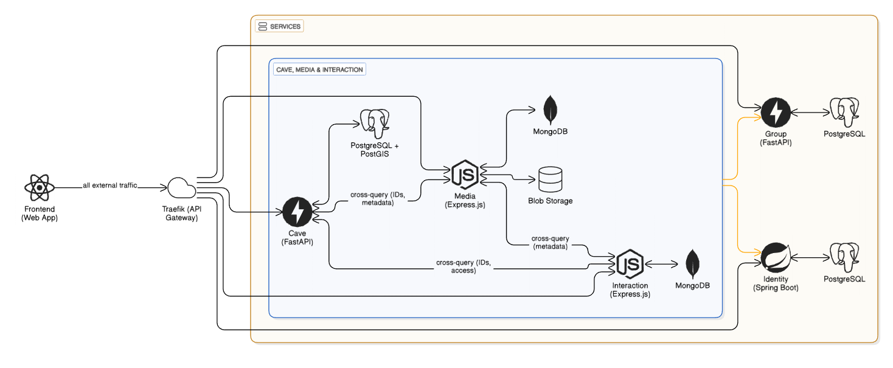

# Skálázható szoftverek - Nagy házi feladat

## Motivation

For the past 30 years, Hungarian cavers have organized annual expeditions to Montenegro to explore and survey the caves of the high karst plateau near the Bay of Kotor. Over the decades, these expeditions have uncovered hundreds of new caves, mapped kilometers of previously unknown passages, and produced thousands of documents, maps, and photographs, all of which currently reside in a only loosely organized Google Drive.

This project aims to create a dedicated platform that will bring order to this wealth of information and make it easily accessible to everyone involved.

## Project description

The CaveDB is a collaborative geospatial platform created to help exploration teams catalog, visualize, and share their discoveries.

It serves as a centralized digital archive where each team can securely manage its own cave data - including entrance coordinates, survey maps, physical measurements, and media - with editing rights limited strictly to group members. At the same time, the system brings all submitted data together on a public, interactive map, enabling the wider community to explore cave locations, view photo galleries, and join the discussion through comments on individual discoveries.

## Requirement specification

- The system shall allow users to register, log in, and maintain a secure session.
- Users must be able to create expedition groups, invite members, and assign administrative privileges.
- Users must be able to store cave data (location, depth, length, etc.) but only for caves owned by their group.
- The system must display cave entrances as markers on a global map interface.
- Users must be able to upload, store, and view photos and survey documents attached to specific caves.
- The system must allow authenticated users to discuss caves via a comment section.
- The system must restrict editing capabilities so that only group members can modify their group's caves.

## Architecture and technologies

The application was split into microservices based on domain-driven design and bounded contexts, with the purpose to build high cohesion within the boundary and low coupling outside of it. This approach ensures that each service encapsulates a clearly defined domain, such as authentication, group management, cave data handling, media storage, or mapping.

| Component / Service   | Technology                          | Description (Communication & Role)                                                           |
|-----------------------|-------------------------------------|----------------------------------------------------------------------------------------------|
| Frontend (Web App)    | React                               | Sends all API requests through Traefik and displays maps, media, and cave data to users.     |
| Traefik (API Gateway) | Traefik                             | Routes incoming HTTPS requests to internal services and performs TLS termination.            |
| Identity Service      | Spring Boot + PostgreSQL            | Validates logins, issues JWTs, and authenticates requests forwarded by Traefik.              |
| Group Service         | FastAPI + PostgreSQL                | Manages expedition groups, memberships, and permissions for other services.                  |
| Cave Service          | FastAPI + PostgreSQL + PostGIS      | Handles cave metadata, geospatial queries, and cross-checks permissions with Group Service.  |
| Media Service         | Express.js + MongoDB + Blob Storage | Receives file uploads from the frontend and returns URLs for cave-related media.             |
| Interaction Service   | Express.js + MongoDB                | Stores and retrieves comments tied to cave IDs.                                              |
| RabbitMQ              | RabbitMQ                            | Acts as the message broker for asynchronous events between services.                         |



## Setup

Using helm:

```bash
# Add Helm repos
helm repo add cnpg https://cloudnative-pg.github.io/charts
helm repo add traefik https://traefik.github.io/charts

# Update and install/upgrade
helm repo update
helm upgrade --install cnpg --namespace cnpg-system --create-namespace cnpg/cloudnative-pg
helm install cavemap ./charts
```

